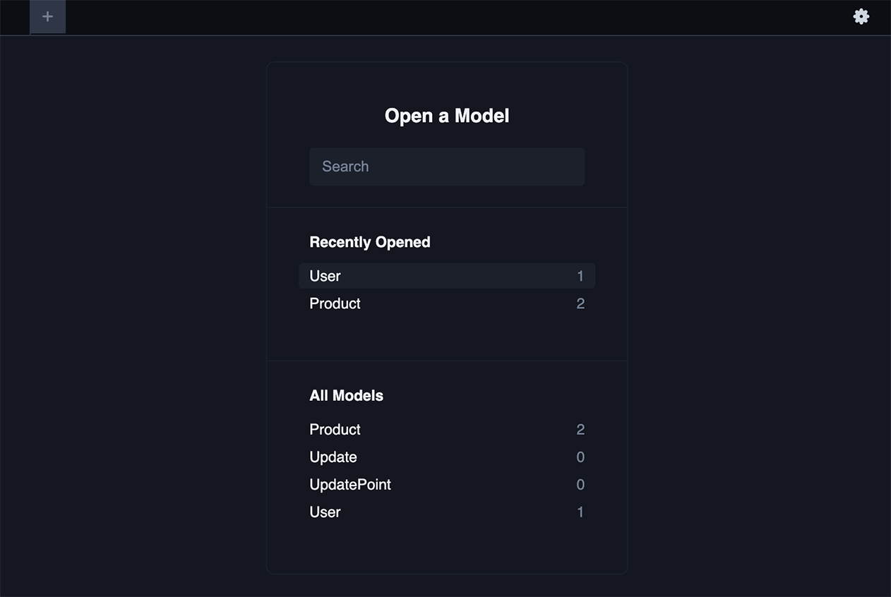

# Change Log API
This is a REST API for a change log application.
It allows us to create users, authenticate users, create products, update products, get products, and get updates.
It's built with Express, Postgres, and uses TypeScript to take advantage of type checked data introspection with Prisma's ORM.

## Installation
**To use the API, you will need to connect a database (This application was built with a free Render db)**

To install dependencies, run `$ npm install`  or  `$ npm i`.

To initialize [Prisma](https://www.prisma.io/) (for setting up your db schema), run `$ npx prisma init`

- Add **your** external db's url and a JWT_SECRET to the `.env` file Prisma created. [See Prisma documentation](https://www.prisma.io/docs/getting-started/setup-prisma/start-from-scratch/relational-databases/connect-your-database-typescript-postgres)

- Design a schema for your data in `prisma/schema.prisma` once created.

- Run a [migration](https://www.prisma.io/docs/concepts/components/prisma-migrate/get-started) to sync the db with your Prisma schema `$ prisma migrate dev --name <name>`

To begin interacting with the Change Log database, run `$ npm run dev`
  - Recommend using the VS Code Thunderclient extension for requests.
  - For authentication, make a a POST to `/user` with a `username` and `password` to create a user, get a JWT, and get started.

To view and edit in [Prisma Studio](https://www.prisma.io/docs/concepts/components/prisma-studio), run `$ npx prisma studio`

## Credits
This is the completed project from [Scott Moss's API Design v4](https://github.com/Hendrixer/api-design-v4-course)

